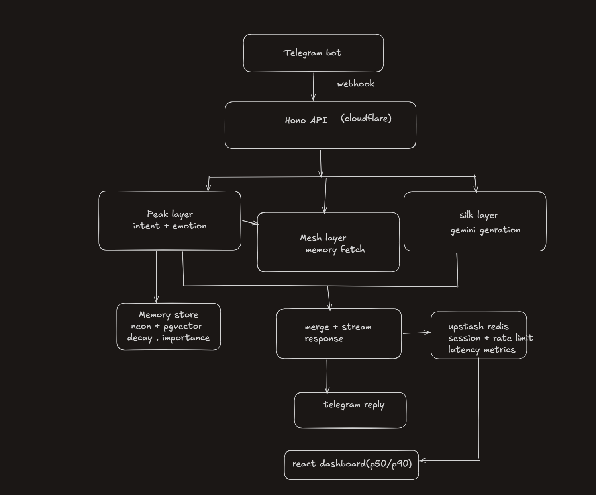

The IVFFlat index needs at least 1000 rows to be effective. For early stage, use HNSW instead -- it works well at any size.

Cloudflare Workers can't use pg (it needs TCP). Use Neon's HTTP driver instead — it works over fetch:Cloudflare Workers run in a V8 isolate, not a real Node.js environment. This is the core reason.

Neon built an HTTP wrapper around Postgres queries. Instead of a TCP socket, it sends your SQL as an HTTP POST:

your code → fetch() → Neon HTTP endpoint → Neon proxies it → Postgres

That sql call is literally just a fetch() under the hood. Which Workers can do fine.

my DB design now 

CREATE EXTENSION IF NOT EXISTS vector;

CREATE TABLE users (
  id             TEXT        PRIMARY KEY,
  platform       TEXT        NOT NULL DEFAULT 'telegram',
  created_at     TIMESTAMPTZ DEFAULT NOW(),
  last_active_at TIMESTAMPTZ DEFAULT NOW()
);

CREATE TABLE memories (
  id            UUID        PRIMARY KEY DEFAULT gen_random_uuid(),
  user_id       TEXT        NOT NULL REFERENCES users(id) ON DELETE CASCADE,
  content       TEXT        NOT NULL,
  importance    FLOAT       DEFAULT 0.5,
  access_count  INTEGER     DEFAULT 0,
  last_accessed TIMESTAMPTZ DEFAULT NOW(),
  created_at    TIMESTAMPTZ DEFAULT NOW(),
  decay_rate    FLOAT       DEFAULT 0.1,
  tags          TEXT[],
  embedding     vector(768)
);

CREATE TABLE messages (
  id         UUID        PRIMARY KEY DEFAULT gen_random_uuid(),
  user_id    TEXT        NOT NULL REFERENCES users(id) ON DELETE CASCADE,
  role       TEXT        NOT NULL CHECK (role IN ('user', 'assistant')),
  content    TEXT        NOT NULL,
  created_at TIMESTAMPTZ DEFAULT NOW()
);

CREATE INDEX ON memories USING hnsw (embedding vector_cosine_ops);
CREATE INDEX ON memories (user_id);
CREATE INDEX ON memories (user_id, last_accessed DESC);
CREATE INDEX ON messages (user_id, created_at DESC);

